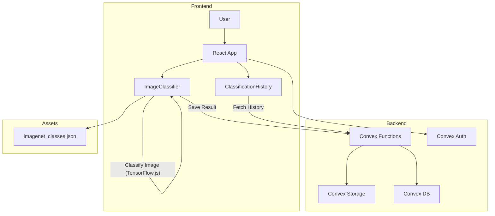
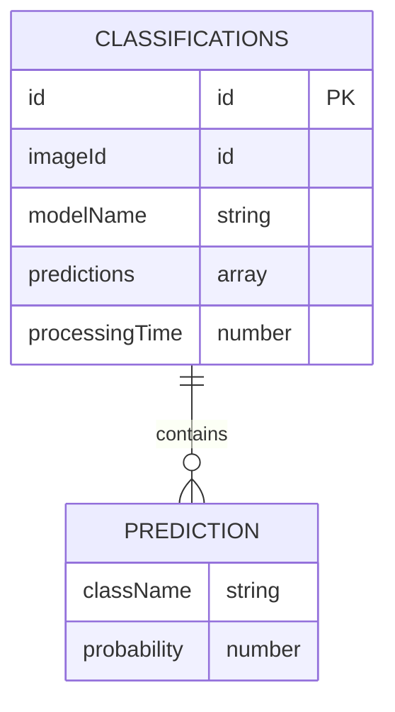

# Image Classification App with TensorFlow.js


---

## 🚀 Overview

This web app lets you classify images using AI directly in your browser! Built with React, TensorFlow.js (MobileNet), and Convex for a seamless, full-stack experience. Upload an image, get instant predictions, and view your classification history—all with modern authentication and a beautiful UI.

- **Live Convex deployment:** [`cautious-opossum-87`](https://dashboard.convex.dev/d/cautious-opossum-87)

---

## ✨ Features

- 🔒 **Authentication:** Anonymous sign-in via Convex Auth (easy to customize)
- 🖼️ **Image Upload:** Drag & drop or file picker
- 🤖 **AI Classification:** Fast, in-browser predictions with MobileNet (1000+ classes)
- 📝 **History:** View your last 20 classifications with images, model, time, and top predictions
- ☁️ **Cloud Storage:** Images and results stored in Convex
- 📊 **Progress Bars & Skeletons:** Smooth UX with loading states
- 📱 **Responsive UI:** Built with Tailwind CSS

---

## 🗂️ Project Structure

| Path         | Description                |
|--------------|----------------------------|
| `src/`       | Frontend (React, TS, UI)   |
| `convex/`    | Backend (Convex functions) |
| `public/`    | Static assets (classes)    |
| `package.json` | Scripts & dependencies   |

---

## 🏗️ Architecture

### System Flow



### Database Schema



---

## 🛠️ Technology Stack

| Layer      | Tech/Library                |
|------------|----------------------------|
| Frontend   | React, TypeScript, Vite     |
| Styling    | Tailwind CSS                |
| ML         | TensorFlow.js, MobileNet    |
| Backend    | Convex                      |
| Auth       | Convex Auth (Anonymous)     |
| Storage    | Convex Storage              |

---

## 📦 Main Scripts

| Script         | Description                        |
|----------------|------------------------------------|
| `npm run dev`  | Start frontend & backend (dev)      |
| `npm run lint` | Typecheck & lint all code           |

---

## 🔑 Authentication

- Uses [Convex Auth](https://auth.convex.dev/) with Anonymous auth for easy sign in.
- You can customize authentication in `convex/auth.ts` and `convex/auth.config.ts`.

---

## 🏁 Getting Started

1. **Install dependencies:**
   ```bash
   npm install
   ```
2. **Start the app (frontend + backend):**
   ```bash
   npm run dev
   ```
3. **Open your browser:**
   The app will open automatically (default: [http://localhost:5173](http://localhost:5173))

---

## 🧠 Model Details

- **Model:** MobileNet v2 (TensorFlow.js)
- **Classes:** 1000+ (from `public/imagenet_classes.json`)
- **Top-5 predictions** shown for each image
- **Processing time** is displayed for each classification

---

## 📚 Further Reading

- [Convex Docs](https://docs.convex.dev/)
- [TensorFlow.js Models](https://www.tensorflow.org/js/models)
- [Vite](https://vitejs.dev/)
- [Tailwind CSS](https://tailwindcss.com/)